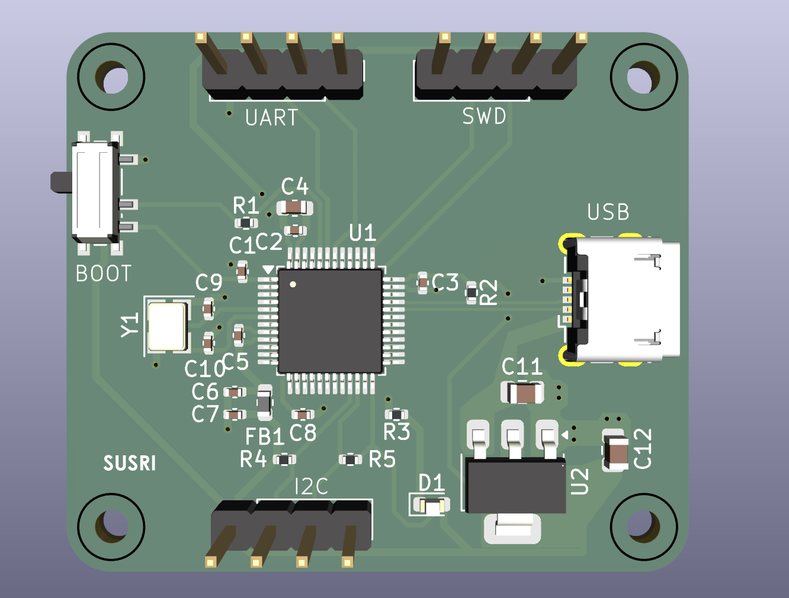

# STM32 Custom PCB Design (Practice Project)

This repository contains a **practice schematic** for an STM32-based custom PCB design created using **KiCad EDA**.  
It is **not a manufactured board** — intended purely for learning and experimentation with schematic design and layout principles.

---

## 🧩 Overview

The design features an **STM32F103C8T6** microcontroller and includes:
- **Power Regulation**: AMS1117-3.3 voltage regulator circuit for USB 5V to 3.3V conversion.
- **Microcontroller Core**: STM32F103C8T6 with crystal oscillator (16 MHz), reset and boot circuitry.
- **USB Interface**: Micro‑USB connector for power and communication.
- **Peripheral Headers**: USART, I²C, and GPIO pin headers for external interfacing.
- **Mounting Holes**: For mechanical support and PCB placement.

---

## ⚙️ Tools Used
- **KiCad Version**: 10.0.3  
- **File Types**:
  - `.kicad_pro` – Project file  
  - `.kicad_sch` – Schematic file  
  - `.kicad_pcb` – PCB layout (if applicable)  
  - Custom symbol and footprint libraries (if used)

---

## 🧠 Purpose
This project serves as a **learning exercise** to:
- Practice schematic capture and PCB layout in KiCad.
- Understand STM32 microcontroller pinouts and peripheral connections.
- Explore power regulation and USB interface design.

---

## ⚠️ Disclaimer
> This schematic is **for educational and testing purposes only**.  
> It has **not been fabricated or electrically tested**.  
> Do not use it for production or safety‑critical applications.

---

## 📸 Preview

---

## 🧾 License
You may freely use, modify, and share this design for **non‑commercial educational purposes**.

---

